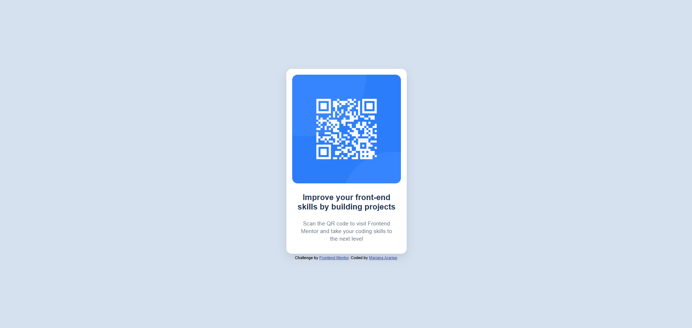

# Frontend Mentor - QR Code Component Solution

Este é um projeto baseado no desafio [QR code component](https://www.frontendmentor.io/challenges/qr-code-component-iux_sIO_H) do Frontend Mentor. O desafio consiste em criar um componente visual de QR code, com layout fiel ao design proposto, usando HTML e CSS.

## 🚀 Tecnologias Utilizadas

- HTML5 semântico
- CSS3
- Flexbox
- Responsividade básica

---

## 🎯 Objetivo

Reforçar conceitos fundamentais de estrutura HTML, estilização com CSS, centralização com Flexbox e responsividade. Ótimo exercício de atenção aos detalhes e construção de layouts a partir de um design estático.

---

## 📸 Screenshot

---

## 🔗 Links

- [🔗 Visualizar Projeto](https://marianaararipe.github.io/qr-code-component/)
- [📂 Repositório no Frontend Mentor](https://www.frontendmentor.io/solutions/qr-code-component-with-html-and-css-a9Ceu-O_OT)
- [📂 Código no GitHub](https://github.com/marianaararipe/qr-code-component)

---

## 💡 O que aprendi

- Refinamento no uso de unidades relativas e absolutas no CSS

---

## 📚 Recursos úteis

- [Guia do Flexbox - CSS Tricks](https://css-tricks.com/snippets/css/a-guide-to-flexbox/)
- [MDN - HTML & CSS docs](https://developer.mozilla.org/)

## 👤 Autor

- GitHub: [@marianaararipe](https://github.com/marianaararipe)
- Frontend Mentor: [@marianaararipe](https://www.frontendmentor.io/profile/marianaararipe)

## ✅ Status

✔️ Desafio concluído com sucesso!  
Pronto para o próximo 😄
